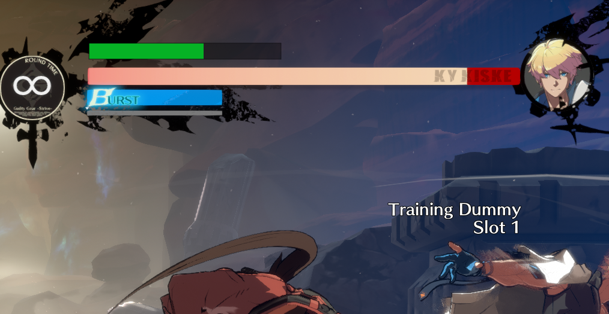
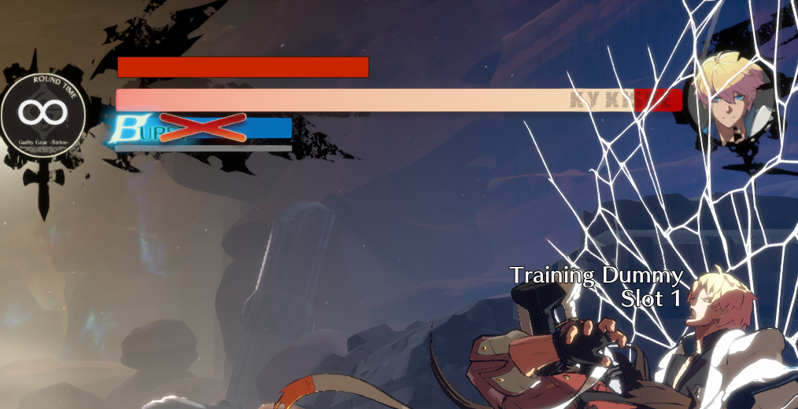

# StriveOverlay

ProgressBar to show wallbreak meter:

StriveUtils: https://github.com/argoneuscze/StriveUtils

## How to use

- Download [.NET 5 runtime](https://dotnet.microsoft.com/download/dotnet/thank-you/runtime-desktop-5.0.7-windows-x64-installer)
- Download the [latest release](https://github.com/carekovisk/StriveOverlay/releases/latest)

- Load up the game
- Set GGST to borderless fullscreen
- Go to practice mode
- Run the .exe
